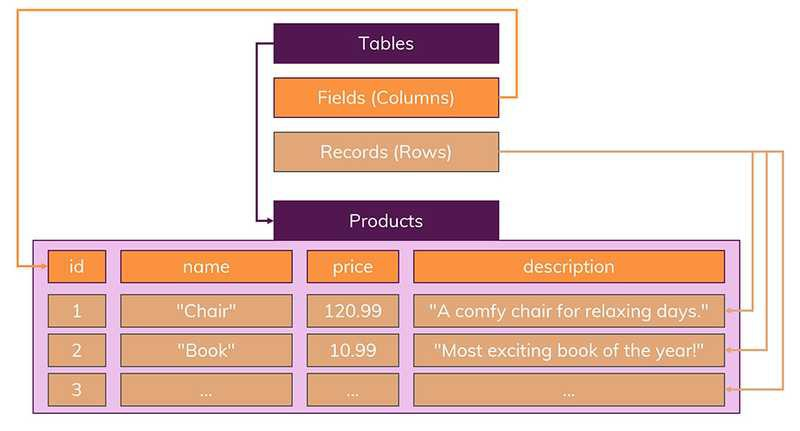

# RDS vs NoSQL

## RDS (관계형 데이터베이스)

- 데이터는 `정해진(엄격한) 데이터 스키마`를 따라 데이터베이스 테이블에 저장된다.
- 데이터는 `관계`를 통해 연결된 여러개의 테이블에 분산된다.

### 1. 엄격한 스키마

- 데이터는 테이블에 레코드로 저장되며, 각 테이블에는 명확하게 정의된 구조가 있다.
- 스키마를 준수하지 않는 레코드는 추가할 수 없다.

### 2. 관계

- 데이터들을 여러개의 테이블에 나누어서, 데이터들의 중복을 피한다.
  

## NoSQL (비관계형 데이터베이스)

- 기본적으로 SQL (관계형 데이터베이스)와 반대되는 접근방식을 따르기 때문에 지어진 이름이다.
  - `스키마없음`
  - `관계없음`

### 문서(documents)

- NoSQL에서는 레코드를 문서(document)라고 부른다.
- SQL에서는 정해진 스키마를 따르지 않는다면 데이터를 추가할 수 없지만, NoSQL에서는 다른 구조의 데이터를 같은 컬렉션에 추가할 수 있다.

### 데이터 복제

- 일반적으로 관련 데이터를 동일한 컬렉션에 넣는다.
- 실제로 NoSQL 데이터베이스는 조인이라는 개념이 존재하지 않는다.
- 대신 컬렉션을 통해 데이터를 복제하여 각 컬렉션 일부분에 속하는 데이터를 정확하게 산출하도록 한다.

## [수직적(Vertical) & 수평적(Horizontal) 확장(Scaling)]

- 데이터가 저장되는 방식 때문에 SQL 데이터베이스는 일반적으로 수직적 확장만을 지원한다. 수평적 확장은 NoSQL 데이터베이스에서만 가능하다.

- **수직 확장** : 단순히 데이터베이스 서버의 성능을 향상시키는 것
- **수평 확장** : 더 많은 서버를 추가하고 데이터베이스를 전체적으로 분산시킴

|      | RDB                                                                                                                                                                                    | NoSQL                                                                                                                                                                                                                       |
| :--- | :------------------------------------------------------------------------------------------------------------------------------------------------------------------------------------- | :-------------------------------------------------------------------------------------------------------------------------------------------------------------------------------------------------------------------------- |
| 장점 | <pre>- 명확하게 정의 된 스키마</pre>- 관계를 통한 중복성 제거                                                                                                                          | <pre>- 높은 유연성</pre> <pre>- 애플리케이션에 필요한 형식으로 저장되므로 데이터 조회 속도 증가</pre> <pre>-수직 및 수평 확장이 가능하므로 데이터베이스가 애플리케이션에서 발생시키는 모든 읽기/쓰기 요청을 처리 가능</pre> |
| 단점 | <pre>- 상대적으로 덜 유연함</pre> <pre>- Join문으로 인한 복잡한 쿼리</pre> <pre>- 수평 확장이 어려워 어느 시점에서 처리량/처리 능력과 관련하여 약간의 한계에 직면하게 될 수 있음</pre> | <pre>- 유연성 때문에 데이터 구조 결정이 늦어질 수 있음</pre> <pre>- 복사된 데이터가 변경되면 여러 콜렉션과 문서를 수정해야함</pre>                                                                                          |

## RDB를 선택하는 경우

- 앱의 여러 부분에서 관련 데이터가 비교적 자주 변경되는 경우
- 명확한 스키마가 중요하며, 데이터구조가 극적으로 변경되지 않을 때

## NoSQL을 선택하는 경우

- 정확한 데이터 요구사항을 알 수 없거나 관계를 맺고 있는 데이터가 자주 변경되는 경우
- 읽기 처리를 자주하지만, 데이터를 자주 변경하지 않는 경우
- 데이터베이스를 수평으로 확장해야 하는 경우 (즉, 막대한 양의 데이터를 다뤄야 하는 경우, 읽기/쓰기 처리량이 큰 경우)

### NoSQL이 뜨는 이유

- 인터넷이 활성화되고, 소셜네트워크 서비스 등이 등장하면서 비정형 데이터를 보다 쉽게 담아서 저장하고 처리할 수 있는 구조를 가진 데이터 베이스들이 관심을 받게 됨.
- 또한 수평적 확장이 가능하므로 빅데이터를 저장할 수 있음.
