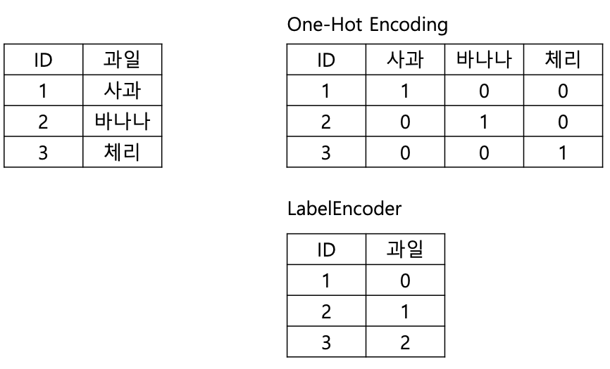

# 데이터 전처리 - 인코딩 방식
> 문자열 값들 즉 범주형 데이터들을 숫자 형으로 인코딩하는 전처리 작업을 위해선 인코딩을 해야한다. 인코딩 방식에는 크게 레이블 인코딩과 원-핫 인코딩이 있다.

## 레이블 인코딩 (Lable encoding)
> 단순히 범주형 데이터를 숫자 값으로 변환하는 것

### 사용 상황
- 순서의 의미가 있을때
- 고유값의 개수가 많을떄

## 원-핫 인코딩 (One Hot Encoding)
> 피처 값의 유형에 따라 새로운 피처를 추가하고 고유 값에 해당하는 컬럼에만 1을 표시하고 나머지 컬럼에는 0을 표시하는 방법이다.

### 사용 상황
- 순서가 없을 때
- 고유값의 개수가 많지 않을 떄

