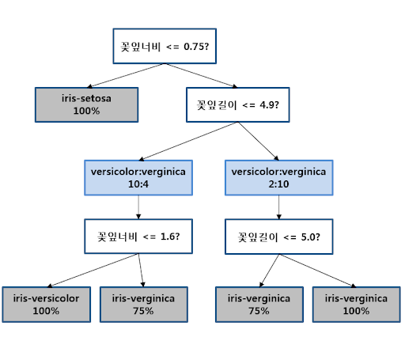

# 머신러닝의 종류

## 지도 학습

### 선형 회귀 (Linear Regression)

- 가장 기본적이고 널리 사용되는 기계 학습 알고리즘 중 하나
- 가장 적합한 직선(회귀선)을 사용하여 **종속 변수(Y)**와 **하나 이상의 독립 변수(X)** 간의 관계를 모델링

### 로지스틱 회귀 (Logistic Regression)

- 데이터가 어떤 범주에 속할 확률을 0에서 1 사이의 값으로 예측 
- 그 확률에 따라 가능성이 더 높은 범주에 속하는 것으로 **분류**
- 시그모이드 함수를 사용
  

### 서포트 벡터 머신 (SVM, Support Vector Machine)

- 결정 경계(Decision Boundary), 즉 분류를 위한 기준 선을 정의하는 모델
- 최적의 결정 경계는 마진을 최대화
- n개의 속성을 가진 데이터에는 최소 n+1개의 서포트 벡터가 존재

`서포트 벡터(support vectors) : 결정 경계에 가장 가까운 각 클래스의 점들`

`마진(margin) : 서포트 벡터와 결정 경계 사이의 거리`

### 결정 트리 (Decision Tree) & 랜덤 포레스트 (Random Forest)
#### 결정 트리

- 특정 기준(질문)에 따라 데이터를 구분하는 모델
#### 랜덤 포레스트
- 각기 다른 학습 데이터를 이용해 학습한 결정 트리를 모아놓은 분류기

### KNN (k-Nearest Neighbors)
- 데이터로부터 거리가 가까운 'k'개의 다른 데이터를 참조하여 분류하는 알고리즘