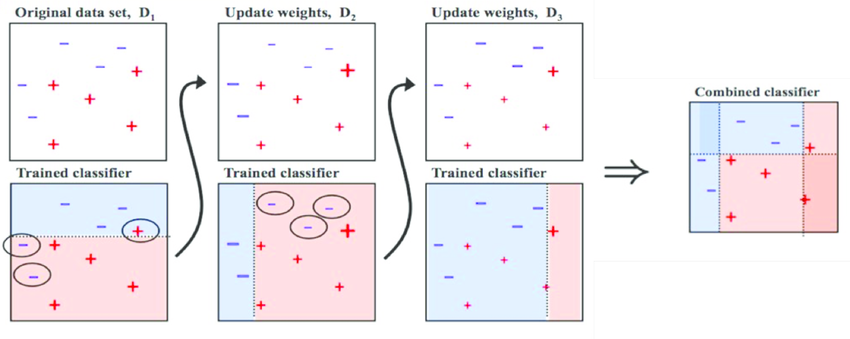

# XGBoost, 그리고 Bagging과 Boosting

> 여러 Decision Tree를 조합하여 사용하는 Ensemble 알고리즘.

## Ensemble

>앙상블 알고리즘은 방식에 따라 Bagging과 Boosting으로 분류된다.

### Bagging

- 각 모델에서 나온 값을 계산하여, 최종 결과값을 내는 방식
- 배깅은 샘플을 여러 번 뽑아 각 모델을 학습시켜 결과물을 집계하는 방법

### Boosting

- 오분류된 샘플에 더 많은 가중치를 주어 학습하는 방식
- 처음 모델이 예측을 하면 그 예측 결과에 따라 데이터에 가중치가 부여되고, 부여된 가중치가 다음 모델에 영향을 준다. 잘못 분류된 데이터에 집중하여 새로운 분류 규칙을 만드는 단계를 반복한다.

> 개별 결정 트리의 낮은 성능이 문제라면 부스팅이 적합하고, 오버 피팅이 문제라면 배깅이 적합

## XGBoost

- 병렬 학습이 지원되는 Gradient Boost
- 성능이 좋고, 컴퓨팅 자원 활용률이 좋음
- 과적합 방지가 가능
- 분류와 회귀를 모두 지원