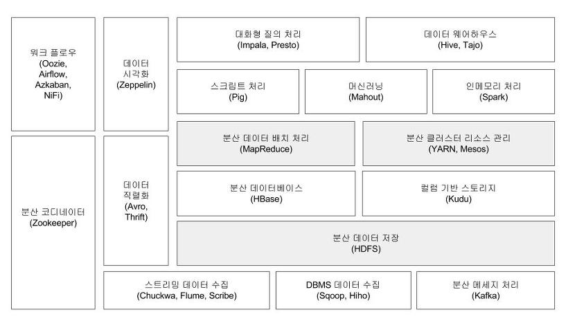

# 하둡 에코시스템

> 하둡의 코어 프로젝트는 HDFS와 MapReduce지만 그 외에도 다양한 서브 프로젝트들이 많이 있다. 하둡 에코시스템은 바로 그 프레임워크를 이루고 있는 다양한 서브 프로젝트들의 모임이다.

## 코디네이터

### Zookeeper

> 분산 환경에서 서버 간의 상호 조정이 필요한 다양한 서비스를 제공하는 시스템

- 하나의 서버에만 서비스가 집중되지 않게 서비스를 알맞게 분산해 동시에 처리하게 해준다.
- 하나의 서버에서 처리한 결과를 다른 서버와도 동기화하여 데이터의 안정성을 보장한다.
- 운영 서버에 문제가 발생해서 서비스를 제공할 수 없을 경우, 다른 대기 중인 서버를 운영 서버로 바꿔서 서비스가 중지 없이 제공되게 한다.
- 분산 환경을 구성하는 서버의 환경설정을 통합적으로 관리한다.

---

## 리소스 관리

### YARN

> 데이터 처리 작업을 실행하기 위한 클러스터 자원 (CPU, 메모리, 디스크 등)과 스케줄링을위한 프레임워크

### Mesos

> 클라우드 인프라스트럭처 및 컴퓨팅 엔진의 다양한 자원 (CPU, 메모리, 디스크)을 통합적으로 관리할 수 있도록 만든 자원 관리 프로젝트

---

## 데이터 저장

### HBase

> HDFS 기반의 컬럼 기반 데이터베이스

- 실시간 랜덤 조회 및 업데이트가 가능하며, 각 프로세스는 개인의 데이터를 비동기적으로 업데이트할 수 있다.
- 맵리듀스는 일괄 처리 방식으로 수행된다.

### Kudu

> 컬럼 기반의 스토리지

- 특정 컬럼에 대한 데이터 읽기를 고속화할 수 있다.
- HDFS와 HBase의 단점을 극복하여 데이터의 발생부터 분석까지의 시간을 단축할 수 있다.

---

## 데이터 수집

### Chukwa

> 분산 환경에서 생성되는 데이터를 HDFS에 안정적으로 저장하는 플랫폼

- 분산된 각 서버에서 에이전트(agent)를 실행하고, 콜렉터(collector)가 에이전트로부터 데이터를 받아 HDFS에 저장한다.
- 콜렉터는 100개의 에이전트당 하나씩 구동된다.
- 데이터 중복제거 등의 작업은 맵리듀스로 처리한다.

### Flume

> 척와처럼 분산된 서버에 에이전트가 설치되고, 에이전트로부터 데이터를 전달받는 콜랙터로 구성

- 척와와의 차이점은 전체 데이터의 흐름을 관리하는 마스터 서버가 있어서 데이터를 어디서 수집하고, 어떤 방식으로 전송하고, 어디에 저장할지를 동적으로 변경할 수 있다.

### Scribe

> 척와와는 다르게 데이터를 중앙 집중 서버로 전송하는 방식

### Sqoop

> 대용량 데이터 전송 솔루션

- HDFS, RDBMS, DW, NoSQL 등 다양한 저장소에 대용량 데이터를 신속하게 전송하는 방법을 제공한다.

### Hiho

> 스쿱과 같은 대용량 데이터 전송 솔루션이며, 현재 깃헙에 공개돼 있다.

### Kafka

> 데이터 스트림을 실시간으로 관리하기 위한 분산 메세징 시스템

- 발행(publish)-구독(subscribe) 모델로 구성되어 있다.
- 데이터 손실을 막기 위해 디스크에 데이터를 저장한다.
- 파티셔닝을 지원하여 다수의 카프카 서버에서 메세지를 분산 처리할 수 있다.
- 시스템의 안전성을 위해 로드밸런싱과 내고장성을 보장한다.

---

## 데이터 처리

### Pig

- 복잡한 맵리듀스 프로그래밍을 대체할 피그 라틴(Pig Latin)이라는 자체 언어를 제공
- 맵리듀스 API를 매우 단순화한 형태이고 SQL과 유사한 형태로 설계

### Mahout

> 하둡 기반으로 데이터 마이닝 알고리즘을 구현한 오픈소스 프로젝트

- 분류,클러스터링,추천 및 협업 필터링, 패턴 마이닝, 회귀 분석,차원 리덕션, 진화 알고리즘 등 주요 알고리즘을 지원

### Spark

> 인메모리 기반의 범용 데이터 처리 플랫폼

- 배치 처리, 머신러닝, SQL 질의 처리, 스트리밍 데이터 처리, 그래프 라이브러리 처리와 같은 다양한 작업을 수용할 수 있도록 설계

### Impala

> 하둡 기반의 분산 퀴리 엔진

### Presto

> 페이스북에서 개발한 대화형 질의를 처리하기 위한 분산 퀴리 엔진

### Hive

> 하둡 기반의 데이터웨어하우징용 솔루션

- SQL과 매우 유사한 HiveQL이라는 쿼리 언어를 제공
- HiveQL은 내부적으로 맵리듀스 잡으로 변환되어 실행

### Tajo

> 하둡 기반의 데이터 웨어하우스 시스템

- 표준 SQL을 지원
- 질의 유형에 따라 하이브나 스파크보다 1.5 ~ 10배 빠른 성능을 보여준다.

---

## 워크플로우 관리

### OOzie

> 하둡 작업을 관리하는 워크플로우 및 코디네이터 시스템

### Airflow

> 에어비앤비에서 개발한 워크플로우 플랫폼

- 데이터 흐름의 시각화, 스케줄링, 모니터링이 가능
- 하이브, 프레스토, DBMS 엔진과 결합하여 사용 가능

### Azkaban

> 링크드인에서 개발한 워크플로우 플랫폼

- 워크플로우 스케줄러, 시각화된 절차, 인증 및 권한 관리,작업 모니터링 및 알람 등 다양한 기능은 웹 UI로 제공한다.

### Nifi

> 데이터 흐름을 모니터링하기 위한 프레임워크

- 여러 네트워크를 통과하는 데이터 흐름을 웹UI에서 그래프로 표현
- 데이터를 흘려보낼 때 우선순위를 제어할 수 있다.

---

## 데이터 시각화

### Zeppelin

> 빅데이터 분석가를 위한 웹 기반의 분석 도구

- 분석 결과를 즉시 표, 그래프로 표현하는 시각화 지원
- 아이파이썬(iPython)의 노트북(Notebook)과 유사한 기능을 제공

---

## 데이터 직렬화

### Avro

> PRC(Remote Procedure Call)와 데이터 직렬화를 지원하는 프레임워크

- JSON을 이용해 데이터 형식과 프로토콜을 정의하며, 작고 빠른 바이너리 포맷으로 데이터를 직렬화한다.

### Thrift

> 서로 다른 언어로 개발된 모듈들의 통합을 지우너하는 RPC 프레임워크

- 예를 들어, 서비스 모듈은 자바로 개발하고, 서버 모듈은 C++로 개발됐을 때 쓰리프트로 쉽게 두 모듈이 통신하는 코드를 생성할 수 있다.

`출처 : 시작하세요! 하둡 프로그래밍`
