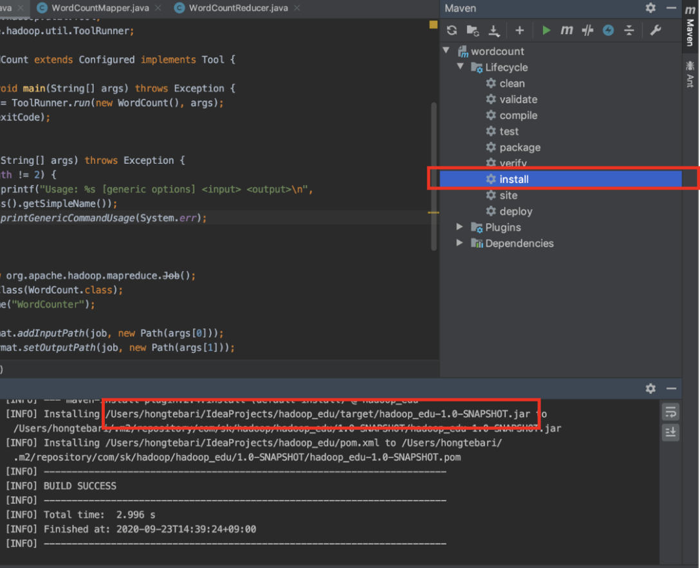

# Hadoop MapReduce WordCount Example

---

### WordCount 예제 코드를 작성한 후 jar 파일로 내려받는다.


---
### 생성된 jar 파일을 HADOOP_HOME 으로 복사한다.

```bash
cd <jar 파일 경로>
mv <jar 파일> $HADOOP_HOME
```

---

### HADOOP HOME 의 LICENSE.txt 파일을 하둡으로 복사

```bash
hadoop fs -mkdir input
hadoop fs -put LICENSE.txt input
```

---

### WordCount 실행
```bash
hadoop jar <jar 파일> <패키지>.WordCount
```
#### 실행 후 결과 확인

```bash
hadoop fs -text output/part-r-00000
```