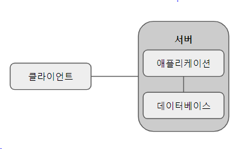
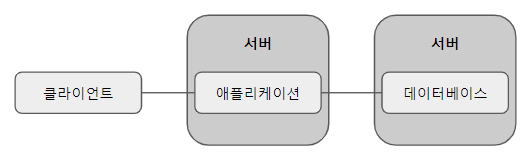
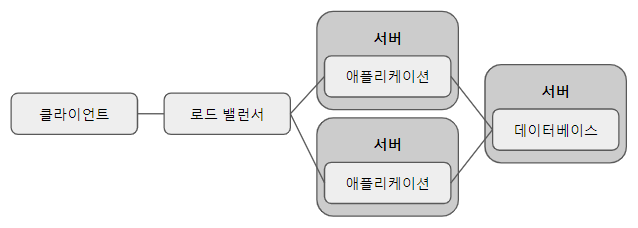
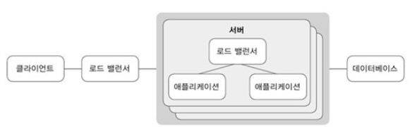

# Theory

## 1.1 운영 서버

- 개발이나 테스트 목적이 아닌 실제 사용자들을 대상으로 서비스하는 서버를 말한다.
- 테스트 서버와 달리, 트래픽 대응도 해야 하고 빠른 응답 속도와 높은 가용성을 보장해야 한다.

## 1.2 운영 서버 관리의 세 단계

### 1. 환경 구성

- 서비스할 코드를 구동시킬 수 있는 서버 인프라를 구축하는 것

### 2. 코드 배포

- 이렇게 구성한 환경에 최신 버전의 코드를 빠르고 안전하게 배포하는 것

### 3. 모니터링

- 안정적인 서비스 운영을 위해 서버와 코드에 어떤 이상이 없는지 바로 파악하고 대응할 수 있게 도와주는 것

## 2.1 운영 서버 아키텍처의 이해

### 2.1.1 단일 서버

- 가장 기본적인 구성으로 서버 내에는 애플리케이션 코드와 데이터베이스가 실행된다.
- 단순한 구성인 만큼 환경을 구축하기 쉬워 테스트 서버나 간단한 애플리케이션을 서비스할 때 많이 사용된다.
- 데이터베이스와 애플리케이션이 같은 서버에서 실행되고 있기에 별도의 네트워크 설정을 할 필요 없이 로컬 호스트를 대상으로 하면 된다.

하지만 다음과 같은 단점이 있다.

1. 전체 서비스에 장애가 생길 확률이 높다.
2. 서버 자원을 효율적으로 사용하기 어렵다.
3. 보안성이 떨어진다.
4. 서버의 수를 여러 대로 늘려서 자원을 확장하는 스케일 아웃(scale out)이 힘들다.

### 2.1.2 애플리케이션/데이터베이스 서버 분리

- 단일 서버 구성에서 데이터베이스를 별도의 서버로 분리한 구성이다.
- 단일 서버에서 나온 단점들이 해결된다.
- 다만 두 대의 서버를 관리하기 때문에 구성이 조금 더 복잡해진다.
- 두 서버 간의 지연시간과 네트워크 보안을 고려해야한다.
- 클라이언트에서는 하나의 서버를 바라보고 있기 때문에 스케일 아웃은 여전히 힘들다.

### 2.1.3 서버 단위의 로드 밸런서

- 클라이언트가 애플리케이션을 실행하는 서버와 직접 통신하는 대신 로드 밸런서라는 서버와 통신하고 그 뒤에 여러 대의 애플리케이션 서버를 두는 방식이다.
- 클라이언트는 로드 밸런서하고만 통신하고 로드 밸런서가 클라이언트에게서 받은 요청을 뒤에 있는 서버들에게 나눠준다. 뒤에 있는 서버들이 요청을 처리하면 응답은 로드 밸런서를 통해 클라이언트에 전달된다.
- 가장 큰 장점은 스케일 아웃이 가능해진다는 점이다.
- 애플리케이션 서버 중 일부 서버에 장애가 발생해도 로드 밸런서에서 정상 서버에만 요청을 주면 되기에 서비스 장애를 최소화 할 수 있다.
- 다만 모든 요청이 로드 밸런서를 통하기에 로드 밸런서에 장애가 생기지 않도록 주의해야한다.
- 구성이 매우 복잡해진다.

### 2.1.4 서버 내 앱 단위의 로드 밸런서

- 여러 서버에게 요청을 분산하는 서버 단위의 로드 밸런서 외에도 여러 애플리케이션 프로세스들에 요청을 분산시키는 앱 단위의 로드 밸런서가 추가됐다.
- 이처럼 구성하면 하나의 서버에 여러 개의 프로세스를 실행해 하나의 서버에서 여러 개의 요청을 동시에 처리할 수 있다.
- 서버 자원을 최대한으로 사용할 수 있는 만큼의 프로세스를 실행해 서버 자원도 더욱 효율적으로 사용할 수 있다.

## 2.4 웹 서버와 웹 애플리케이션 서버

- 서버 인스턴스에는 클라이언트의 요청을 받아 적절한 응답을 할 수 있는 서버 소프트웨어가 필요하다.
- 서버 소프트웨어에는 크게 웹 서버와 웹 애플리케이션 서버로 구분된다.

### 2.4.1 웹 서버

- 웹 서버는 클라이언트에서 HTTP 프로토콜로 요청을 받고 정적인 파일들을 응답으로 전달한다.
- 대표적인 웹 서버 제품으로 nginx, Apache, IIS 등이 있다.

### 2.4.2 웹 애플리케이션 서버

- 웹 서버와 다르게 클라이언트의 요청에 대해 코드 실행을 통해 동적인 응답을 만들어주는 역할을 한다.
- 배포한 코드를 프로세스로 실행시키고, 해당 프로세스에 클라이언트의 요청을 넘겨주는 역할을 하기도 한다.
- 단순히 프로세스의 실행뿐만 아니라 서버 자원을 최적으로 사용하기 위해 프로세스의 수나 프로세스의 메모리를 조절하기도 한다.
- 애플리케이션의 언어에 맞는 웹 애플리케이션 서버를 선택해야 한다.
- 대표적인 웹 애플리케이션 서버로는 Phusion Passenger, Apache Tomcat, JBoss 등이 있다.

### 2.4.3 웹 서버와 웹 애플리케이션 서버의 사용

- 웹 서버와 웹 애플리케이션 서버는 보통 함께 사용된다.
- 한 서버에서 여러 종류의 애플리케이션을 서비스 하는 경우 웹 서버가 정적 파일을 처리하는 역할이나 여러 웹 애플리케이션 서버로 라우팅하는 역할을 할 수 있다.
- 언어 등 필요한 기능과 상황에 맞게 웹 서버와 웹 애플리케이션 서버 제품을 선택하여 사용하면 된다.
