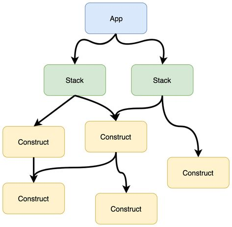
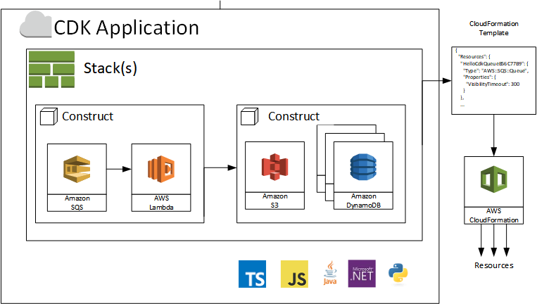

# AWS CDK

- 프로그래밍 언어를 사용하여 클라우드 애플리케이션 리소스를 모델링 및 프로비저닝 해주는 도구이다.
- AWS CDK를 사용하면 인프라를 코드로 정의하고 AWS CloudFormation을 통해 프로비저닝할 수 있다.

> 즉, 익숙한 프로그래밍 언어를 사용하여 클라우드 애플리케이션 리소스를 정의할 수 있는 오픈 소스 소프트웨어 개발 프레임워크이다.

## AWS CDK 구성

### App

- 기본 구문이며, CDK CLI를 통해 AWSCloudFormation 템플릿을 렌더링하고 배포한다.
- 배포 가능한 단위인 하나 이상의 스택으로 구성되며 리전 및 계정에 대한 정보를 포함한다.

### Stack

- AWS 람다, AWS EC2와 같이 AWS 리소스를 표현하는 구문이 포함된다.

### Construct (구문)

- 구문은 계층구조를 가진다. AWS에서 구문은 3가지 레벨로 표현한다.

#### 레벨 1 : AWS CloudFormation 리소스

- 기존 리소스의 1대 1 매핑이며 자동으로 생성된다.
- 선언적 접근 방식의 YAML 또는 JSON에서 사용하는 리소스와 동일하다.

#### 레벨 2 : AWS 구문 라이브러리

- 이러한 구문은 AWS 서비스 레벨에 위치하며, AWS가 직접 작성한 구문이다.
- 적절한 기본값이 설정되어 있으므로 세부 정보에 대한 큰 고민 없이 손쉽게 AWS 리소스를 생성할 수 있다.

#### 레벨 3 : Your awesome stuff

- 어떤 구문은 다른 구문을 기반으로 하는 상위 레벨의 추상화일 수도 있다.
- 레벨 3는 레벨 2의 조합과 추가적인 옵션으로 이루어진다.
- 따라서 입맛대로 필요한 옵션을 곁들여 나만의 stuff를 만들 수 있다.

## AWS CDK 리소스 생성

> App, Stack, Construct로 구성된 CDK Application은 AWS CloudFormation을 통해 리소스가 생성

## 정리

- AWS CDK는 기존의 IaC(Infrastructure as Code)에서 제공하는 **YAML 또는 JSON 형태의 선언전 접근 방식**과 달리 **개발자 친화적인 프로그래밍 언어**로 되어있는 장점이 있다.
- 잘 만든 구문은 재사용성이 높아 생산성이 높아진다.
