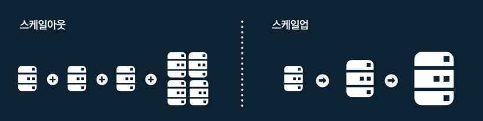

# Scale Out & Scale Up

서버를 운영하다 보면, 갑작스런 이용자의 증가, 사업 확장 등의 이유로 더 많은 서버 용량과 성능이 필요하게 된다. 이럴 때에는 ‘스케일 아웃’과 ‘스케일 업’, 두 가지 방법으로 시스템을 확장시킬 수 있다

## 스케일 아웃

- 서버를 여러 대 추가하여 시스템을 확장하는 방법
- 서버가 여러대가 되므로 서버에 걸리는 부하를 균등하게 해주는 '로드밸런싱'이 필수적으로 동반되어야 함
- 서버 한 대가 장애로 다운되더라도 다른 서버로 서비스 제공이 가능함
- 모든 서버가 동일한 데이터를 가지고 있어야 하므로, 데이터 변화가 적은 '웹 서버'에 적합한 방식

## 스케일 업

- 서버에 CPU나 RAM 등을 추가하거나 고성능의 부품, 서버로 교환하는 방법을 의미함
- 스케일 업 상황에서 현재 서버에 추가 부품을 장착할 수 있는 여유 슬롯이 있어야 하며, 그렇지 않은 경우 서버 자체를 고성능으로 교체해야 함
- 서버 한 대에 모든 부하가 집중되므로 장애 시 영향을 크게 받을 수 있음
- 한 대의 서버에서 모든 데이터를 처리하므로 데이터 갱신이 빈번하게 일어나는 '데이터베이스 서버'에 적합한 방식
