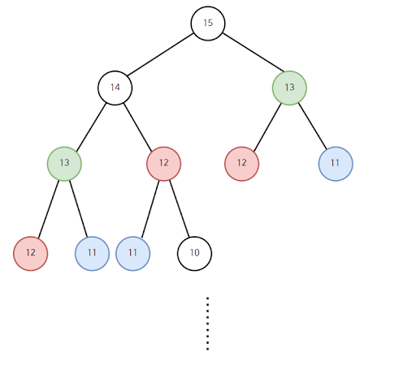

# Dynamic Programming (동적 계획법)

복잡한 큰 문제를 여러 작은 문제로 나누어 푸는 문제를 일컫는 말

## 사용 조건

- 작은 문제가 반복이 일어나는 경우
- 같은 문제는 구할 때마다 답이 같을 경우

## 방식

- 모든 작은 문제들은 한번만 푼다.
- 정답을 구한 문제를 어딘가에 메모한다.
- 다시 그보다 큰 문제를 풀어나갈 때 똑같은 작은 문제가 나타나면 앞서 메모한 작은 문제의 결과값을 이용한다.

### Memoization

앞서 말했듯 작은 문제들이 반복되고 이 작은 문제들의 결과값은 같다.
이점을 이용하여 한번 계산한 작은 문제를 저장해놓고 다시 사용하는 것.

## 예시

### 피보나치 수열

- `다음 수열 = 이전 수열 + 두단계 전 수열` 이라는 점화식을 가짐



**위 그림처럼 분할 정복 방식으로 푼다면 많은 중복된 문제를 그때그때 풀어야 하는 상황이 발생하게 된다.**

#### 1. 작은 문제들이 반복된다.

- `F(5)`를 구하기 위해서는 `F(4)`,`F(3)` 이 필요하다. 다시 `F(4)`를 구하기 위해서는 `F(3)`,`F(2)`가 필요하다.
- 이 경우를 살펴보면 `F(5)`에서도 `F(3)`이 필요하고 `F(4)`에서도 `F(3)`이 필요하다.
- 즉, 작은 문제가 반복되는 구조이다.

#### 2. 같은 문제는 구할때 마다 정답이 같다.

- 피보나치 수열의 경우 첫번째 두번쨰 수열은 각각 1로 고정되어 있다.
- 즉, 3번쨰 수열은 언제나 결과가 2이다.
- 또 4번째 수열은 3번쨰 수열과 2번쨰 수열을 이용해 구하므로 언제나 정답이 같다는 사실을 알수 있다.

#### 코드

```python
def fibo(n):
    if n <= 2 :
        return 1
    else:
        return (fibo(n-2) + fibo(n-1))

```

위 방식처럼 재귀함수로 호출한다면 같은 문제를 여러번 풀게되어 실행 시간이 매우 길어진다.

```python
def memoization_fibo(n):
    if i < 2:
        return 1
    if (memo(n)):
        return memo[n]
    memo[n] = memoization_fibo(n-1) + memoization_fibo(n-2)
    return memo[n]

```

그러나 한번 구한 값을 저장해두는 방식을 사용한다면 매우 빠르게 실행된다.

### Top-Down VS Bottom-Up

동적 계획법은 크게 Top-Down방식과 Bottom-Up방식으로 나뉜다.

#### Top-Down

큰 문제에서 작은 부분 문제를 재귀적으로 호출하여 리턴 되는 값을 이용하여 큰 문제를 해결하는 방식.

함수 호출을 줄이기 위해 앞서 말한 Memoization을 사용한다.

#### Bottom-Up

작은 부분문제들을 미리 계산해두고, 이 부분문제들을 모아 큰 문제를 해결하는 방식.

```python
def memoization_fibo(n):
    memo = []
    for i in range(0,n):
        if i < 2:
            memo.append(1)
        else:
            memo.append(memo[i-2] + memo[i-1])

    return memo[n-1]

```
