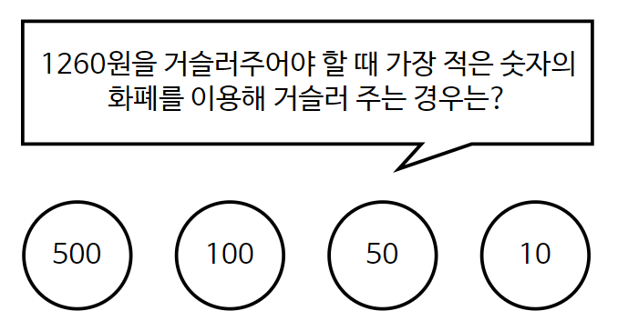

# Greedy Algorithm ( 탐욕 알고리즘 )

- **당장 눈 앞에 보이는 최적의 상황만을 쫓는 알고리즘**
- 매순간 최적이라고 생각되는 것을 선택해 나가는 방식으로 진행하여 최종적인 최적해에 도달하는 기법
- 항상 최적의 결과를 도출하지는 않지만 어느 정도 최적의 해에 근사한 값을 구할 수 있으며 특정한 상황에 있어서는 최적의 해를 보장 할 수도 있다.

## 예시

#### 거스름 돈 문제

**560원을 걸러줄 상황**

`1. 10원 X 56개`
`2. 500원 X 1개 + 50원 X 1개 + 10원 X 1개`

2번의 방식이 더 효율적

따라서, 이런 경우 `무조건 더 큰 화폐 단위부터 거슬러 준다`는 알고리즘만 지키면 **최적의 해**를 보장할 수 있다.



위 상황에선 <u>**무조건 큰 숫자의 화폐부터 골라서 거슬러주면**</u> 된다.

```python
def change(n) :
    cnt = 0
    coin = [500,100,50,10]

    for i in coin:
        cnt += n//i
        n %= i

    print(cnt)

```
