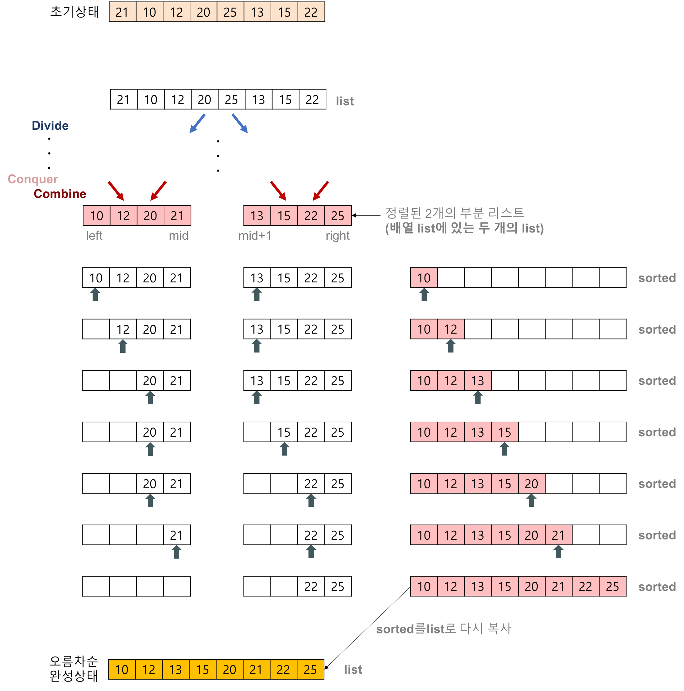

# Merge Sort and Quick Sort

## Merge Sort (합병 정렬)

### Merge Sort (합병 정렬) 이란?
**분할 정복 알고리즘**의 하나

#### 분할 정복 알고리즘
- 문제를 작은 2개의 문제로 분리하고 각각을 해결한 다음, 결과를 모아서 원래의 문제를 해결하는 전략
- 분할 정복 방법은 대개 순환 호출을 이용하여 구현한다.

#### 과정
- 리스트의 길이가 0 또는1 이면 이미 정렬된 것으로 본다.
- 그렇지 않은 경우, **정렬되지 않은 리스트를 절반으로 잘라** 비슷한 크기의 두 부분 리스트로 나눈다.
- 각 부분 리스트를 재귀적으로 합병 정렬을 이용해 정렬한다.
- 두 부분 리스트를 **다시 하나의 정렬된 리스트로 합병**한다.

### Merge sort 알고리즘의 구체적인 개념
합병 정렬은 다음의 단계들로 이루어진다.
- **분할(Divide)** : 입력 배열을 같은 크기의 2개의 부분 배열로 분할한다.
- **정복(Conquer)** : 부분 배열을 정렬한다. 부분 배열의 크기가 충분히 작지 않으면 순환 호출을 이용하여 다시 분할 정복 방법을 적용한다.
- **결합(Combine)** : 정렬된 부분 배열들을 하나의 배열에 합병한다.

#### 합병 정렬의 과정
- 추가적인 리스트가 필요
- 각 부분 배열을 정렬할 떄도 합병 정렬을 순환적으로 호출하여 적용
- 합병 정렬에서 **실제로 정렬이 이루어지는 시점은 2개의 리스트를 합병(merge)하는 단계**

#### 두 개의 리스트를 합병하는 과정
- 2개의 리스트의 값들을 처음부터 하나씩 비교하여 두 개의 리스트의 값 중에서 더 작은 값을 새로운 리스트(sorted)로 옮긴다.
- 둘 중에서 하나가 끝날 때까지 이 과정을 되풀이한다.
- 만약 둘 중에서 하나의 리스트가 먼저 끝나게 되면 나머지 리스트의 값들을 전부 새로운 리스트(sorted)로 복사한다.
- 새로운 리스트(sorted)를 원래의 리스트(list)로 옮긴다.

