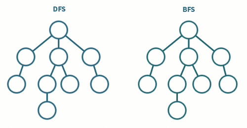

# 깊이 우선 탐색 ( DFS, Depth-First Search )

#### 그래프에서 깊은 부분을 우선적으로 탐색

### 특징

- 순환 알고리즘(재귀 함수)의 형태를 지님
- 스택 자료구조 이용
- 모든 노드를 방문하고자 하는 경우에 이 방법을 선택함

### 과정

### 구현

1. `탐색 시작 노드를 스택에 삽입하고 방문 처리를 한다.`
2. `스택의 최상단 노드에 방문하지 않은 인접 노드가 있으면 그 인접 노드를 스택에 넣고 방문 처리를 한다. 방문하지 않은 인접 노드가 없으면 스택에서 최상단 노드를 꺼낸다.`
3. `2번의 과정을 더 이상 수행할 수 없을 때까지 반복한다.`

---

# 너비 우선 탐색 ( BFS, Breadth-First Search )

#### 가까운 노드부터 탐색

### 특징

- 큐 자료구조 사용
- 두 노드 사이의 최단 경로 혹은 임의의 경로를 찾고 싶을 때 이 방법을 선택함

### 과정

### 구현

1. `탐색 시작 노드를 큐에 삽입하고 방문 처리를 한다`
2. `큐에서 노드를 꺼내 해당 노드의 인접 노드 중에서 방문하지 않은 노드를 모두 큐에 삽입하고 방문 처리를 한다.`
3. `2번의 과정을 더 이상 수행할 수 없을 때까지 반복한다.`

## DFS와 BFS의 차이

|           |      DFS       |       BFS        |
| :-------: | :------------: | :--------------: |
| 동작원리  |      스택      |        큐        |
| 구현 방법 | 재귀 함수 이용 | 큐 자료구조 이용 |

