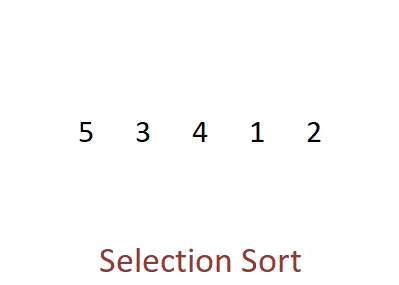
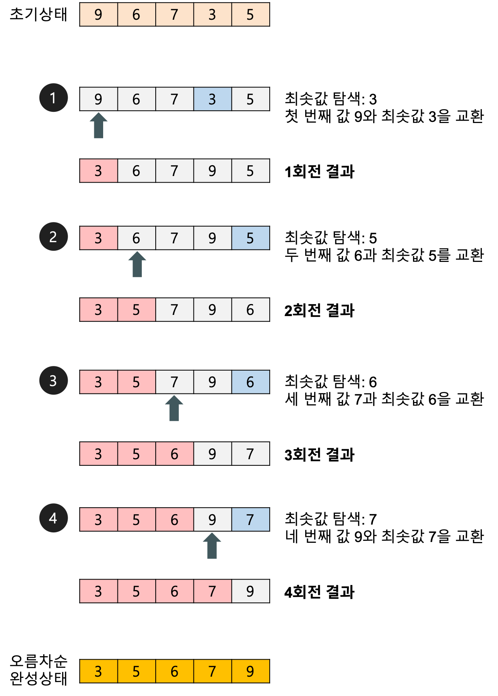

# Selection Sort

## Selection Sort (선택 정렬)



### Selection Sort (선택 정렬) 이란?

- 제자리 정렬(in-place sorting) 알고리즘의 하나
  - 입력 배열(정렬되지 않은 값들) 이외에 다른 추가 메모리를 요구하지 않는 정렬 방법

#### 과정

- 주어진 배열 중 최솟값을 찾는다.
- 그 값을 맨 앞에 위치한 값과 교체한다.
- 맨 처음 위치를 뺀 나머지 리스트를 같은 방법으로 교체한다.
- 하나의 원소만 남을 때까지 위의 1~3 과정을 반복한다.

### 선택 정렬(selection sort) 알고리즘의 구체적인 개념

- 선택 정렬은 첫 번째 자료를 두 번째 자료부터 마지막 자료까지 차례대로 비교하여 가장 작은 값을 찾아 첫 번째에 놓고, 두 번째 자료를 세 번째 자료부터 마지막 자료까지와 차례대로 비교하여 그 중 가장 작은 값을 찾아 두 번째 위치에 놓는 과정을 반복하며 정렬을 수행한다.
- 1회전을 수행하고 나면 가장 작은 값의 자료가 맨 앞에 오게 되므로 그 다음 회전에서는 두 번째 자료를 가지고 비교한다. 마찬가지로 3회전에서는 세 번째 자료를 정렬한다.



### 선택 정렬의 장단점

- 장점
  - 자료 이동 횟수가 미리 결정된다.
- 단점
  - 안정성을 만족하지 않는다.
  - 즉 값이 같은 레코드가 있는 경우에 상대적인 위치가 변경될 수 있다.

### 코드 구현 (파이썬)

```python
def selection_sort(arr):
    for i in range(len(arr) - 1):
        min_idx = i
        for j in range(i + 1, len(arr)):
            if arr[j] < arr[min_idx]:
                min_idx = j
        arr[i], arr[min_idx] = arr[min_idx], arr[i]
```

### 선택 정렬 시간 복잡도

- 비교 횟수
  - 두 개의 for 루프의 실행 횟수
  - 외부 루프: (n-1)번
  - 내부 루프(최솟값 찾기): n-1,n-2, ..., 2,1 번
- 교환 횟수
  - 외부 루프의 실행 횟수와 동일. 즉, 상수 시간 작업
  - 한 번 교환하기 위하여 3번의 이동(SWAP 함수의 작업)이 필요하므로 3(n-1)번
- **T(n) = O(n^2)**
