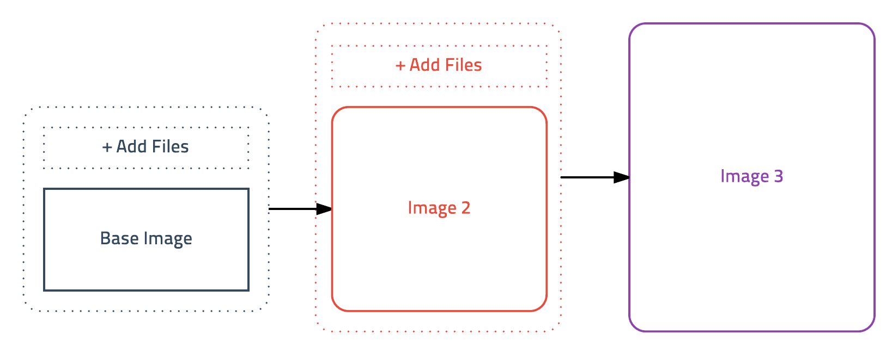

# 도커 이미지 만들고 배포하기

---

## 컨테이너를 이미지로 저장하기

- **기본 컨테이너** + **새로운 이미지** = **커스텀 이미지**
  

```bash
docker run -it ubuntu:latest --name git /bin/bash
```

Base Image로 기본 컨테이너를 생성한다.

```bash
apt-get update
apt-get install -y git
```

git을 설치한다.

```bash
docker commit <container_id> ubuntu:git
```

ubuntu:git 이라는 이름으로 이미지를 생성한다.

```bash
docker run -it ubuntu:git bash
```

생성한 커스텀 이미지로 컨테이너를 생성한다.

### diff

`docker diff <container_id>`
위 명령어를 통해 기존 컨테이너에 추가된 내용을 확인할 수 있다.

## Dockerfile로 이미지 만들기

| 명령어  |               의미               |                                   사용 |
| ------- | :------------------------------: | -------------------------------------: |
| FROM    |        베이스 이미지 지정        |                     FROM <이미지 이름> |
| ADD     |            파일 추가             | ADD <추가할 파일> <파일이 추가될 경로> |
| RUN     |           명령어 실행            |                           RUN <명령어> |
| WORKDIR | RUN이 실행될 작업 디렉터리 변경  |                     WORKDIR <디렉터리> |
| ENV     |       환경변수 기본값 지정       |                        ENV <변수> <값> |
| EXPOSE  | 컨테이너로 실행 시 노출시킬 포트 |                          EXPOSE <포트> |
| CMD     |  이미지의 기본 실행 명령어 지정  |                           CMD <명령어> |

```Dockerfile
FROM ubuntu:latest
RUN apt-get update
RUN apt-get install -y git
```

```bash
docker build -t ubuntu:git02 .
```

현재 디렉토리 내의 도커파일을 사용하여 ubuntu:git02라는 이름의 이미지를 만든다.

- `(도커허브이름)/(이미지이름):(버전)`의 형식을 사용하여 도커허브에 올릴 수 있다.
