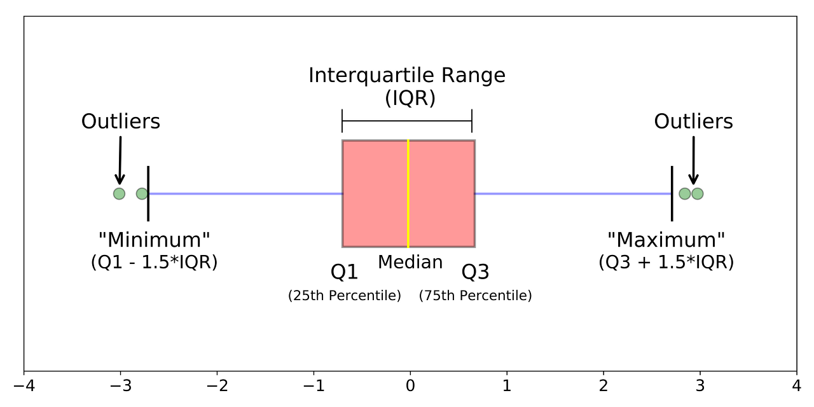

# IQR (Interquartile Range)

> 사분위수의 상위 75% 지점(Q3)의 값과 하위 25% 지점(Q1)의 값 차이 ( Q3 - Q1)

`사분위수 : 데이터 표본을 4개의 동일한 부분으로 나눈 값`



- 최소 제한선 : Q1 - 1.5 \* IQR
- 최대 제한선 : Q3 + 1.5 \* IQR

> 최소 제한선 밑, 또는 최대 제한선 위로 넘어가는 값들을 이상치라고 말할 수 있다.

## 코드

### 이상치 탐색 코드

```python
import numpy as np
import pandas as pd

def detect_outliers(df):
    # 사분위수 25% 지점
    Q1 = np.percentile(df[col],25)
    # 사분위수 75% 지점
    Q3 = np.percentile(df[col],75)
    # 25% 지점과 75% 지점의 차이
    IQR = Q3 - Q1

    # 이상치
    outliers = df[(df[col] < Q1 - 1.5 * IQR) | (df[col] > Q3 + 1.5 * IQR)]

    return outliers

```
