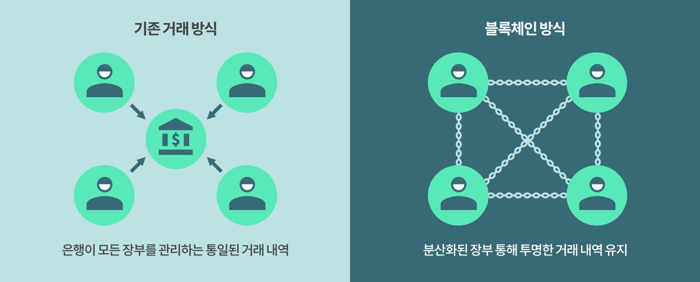

# Blockchain (블록 체인)

## Blockchain(블록 체인) 이란

#### **데이터 분산 처리 기술.**

##### 즉, 네트워크에 참여하는 모든 사용자가 모든 거래 내역 등의 데이터를 분산, 저장하는 기술

- **블록** : 개인과 개인의 거래 (P2P)의 데이터가 기록되는 장부
- **체인** : 이 블록들이 시간의 흐름에 따라 순차적으로 연결된 구조

**'공공 거래장부' . '분산 거래장부'로 불리기도 한다.**

## 기존 거래 방식과의 차이점

### 기존 거래 방식

- **은행**이 모든 거래 내역을 소유
- 은행이 거래의 **중간 역할** 수행
- 송금 과정이 모두 은행에 집중되어 있다. 즉, 은행이 **단일 실패 지점(Single Point Of Failure)**이다.
- 은행의 서버가 정상적으로 작동하지 않거나 은행의 기록이 사라지면 거래내역에 큰 오류가 생긴다.

### 블록체인 방식

- 거래 내역을 **은행이 아닌 여러 명**이 나눠서 저장
- 10명이 참여한다면 10명 모두에게 같은 거래 내역을 전송, 저장
- 거래 내역 확인 시 블록으로 나눠 저장한 데이터들을 연결해 확인
- **거래 정보를 모두에게 복사해서 사본을 정리하고 그 사본기리 동기화** 시킴
- 수만명의 사용자가 같은 기록을 가지고 있기에 기록이 위조되거나 사라지는 일을 원천적으로 막어버림.
