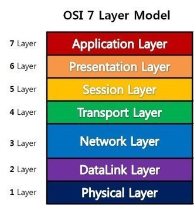

# OSI 7계층 단계



## 1계층 - 물리계층 (Physical Layer)

- 통신 케이블을 통해 전기 신호를 사용하여 비트 스트림을 전송하는 계층
- 단지 데이터를 전기적인 신호로 변환해서 주고 받는 기능만 한다.

```
비트 신호 -> 아날로그 신호
아날로그 신호 -> 비트 신호
```

## 2계층 - 데이터 링크계층 (DataLink Layer)

- 노드와 노드 사이의 데이터 전달
- 물리계층을 통해 송수신되는 정보의 오류와 흐름을 관리
- 통신에서의 오류를 찾고 재전송하는 기능을 가짐
- 맥 주소를 가지고 통신

```
스트림의 처음과 끝에 구분자를 설정
예) 1111,0000
구분자로 송수신 정보를 구분
```

## 3계층 - 네트워크 계층 (Network Layer)

- 송신 측에서 최종목적지까지 패킷을 전달
- 주소(IP)를 정하고 경로(Route)를 선택
- 사용되는 프로토콜의 종류, 라우팅 기술이 다양함

```
IP 주소를 통해 데이터를 전달
```

## 4계층 - 전송 계층(Transport Layer)

- 네트워크계층에서 패킷을 종단까지 전달한다면(네트워크 주소), 전송층은 종단 내에서 최종 수신 프로세스로의 전달(포트주소)를 담당

```
전송받은 데이터를 어떤 프로세스에 줄지 포트번호로 전달
```

## 5계층 - 세션 계층(Session Layer)

- 통신하는 프로세스 사이의 대화제어 및 동기화를 담당
- 네트워크상 양쪽 연결을 관리하고 연결을 지속시켜줌

## 6계층 - 표현 계층 (Presentation Layer)

- 데이터의 변환, 압축, 암호화를 담당
- 응용계층으로부터 전달받거나 전송하는 데이터의 인코딩 및 디코딩을 수행
- 응용 계층에서 데이터를 이해할 수 있도록 변환

## 7계층 - 응용 계층 (Application Layer)

- 사용자에게 서비스 제공 역할 (인터페이스 지원)
- SMTP,FTP,HTTP 등 사용자가 원하는 최종목표에 해당

#### 참조 - [10분 테코톡] 히히의 OSI 7 Layer

https://www.youtube.com/watch?v=1pfTxp25MA8
