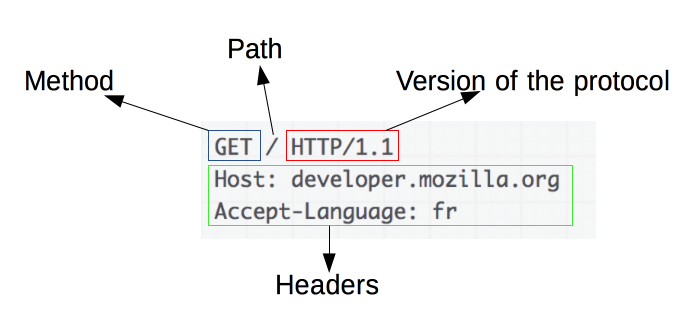

# HTTP vs HTTPS

## HTTP (Hyper Text Transfer Protocol)

- 서버/클라이언트 모델을 따라 데이터를 주고 받기 위한 프로토콜
- 80번 포트를 사용하고 있다.
- 암호화 되지 않은 평문 데이터를 전송하는 프로토콜이기 때문에 해킹의 위험이 있다.

### HTTP의 구조

## HTTPS (Hyper Text Transfer Protocol Secure)

- HTTP에 데이터 암호화가 추가된 프로토콜이다.
- 433번 포트를 사용한다.
- 중간에 제 3자가 정보를 볼 수 없도록 공개키 암호화를 지원하고 있다.

### 공개키 / 개인키

> HTTPS는 공개키/개인키 암호화 방식을 이용해 데이터를 암호화하고 있다. 공개키와 개인키는 서로를 위한 1쌍의 키이다.

- 공개키 : 모두에게 공개 가능한 키
- 개인키 : 나만 가지고 알고 있어야 하는 키

#### 효과

- **공개키 암호화** : 공개키로 암호화를 하면 개인키로만 복호화 할 수 있다. -> 개인키는 나만 가지고 있으므로, 나만 볼 수 있다.
- **개인키 암호화** : 개인키로 암호화 하면 공개키로만 복호화 할 수 있다. -> 공개키는 모두에게 공개되어 있으므로, 내가 인증한 정보임을 알려 신뢰성을 보장할 수 있다.

> 즉, 내가 사이트에 보내는 정보들을 제 3자가 못 보게 하는 동시에 접속한 사이트가 믿을 만한 곳인지 알려준다.

### 동작 과정

1. A기업은 HTTP 기반의 애플리케이션에 HTTPS를 적용하기 위해 공개키/개인키를 발급함
2. CA 기업에게 돈을 지불하고, 공개키를 저장하는 인증서의 발급을 요청함
3. CA 기업은 CA기업의 이름, 서버의 공개키, 서버의 정보 등을 기반으로 인증서를 생성하고, CA 기업의 개인키로 암호화하여 A기업에게 이를 제공함
4. A기업은 클라이언트에게 암호화된 인증서를 제공함
5. 브라우저는 CA기업의 공개키를 미리 다운받아 갖고 있어, 암호화된 인증서를 복호화함
6. 암호화된 인증서를 복호화하여 얻은 A기업의 공개키로 데이터를 암호화하여 요청을 전송함

`CA (Certificate Authority)기업 : 다른 곳에서 사용하기 위한 디지털 인증서를 발급하는 기관`
