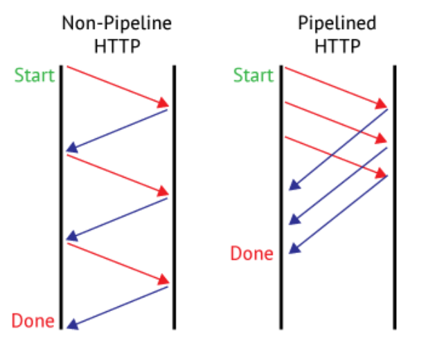

# HTTP 1.1 vs HTTP 2.0

## HTTP 1.1

1. **연결당 하나의 요청과 응답을 처리한다.**

   - Persistent Connection
     - 1.0과 비교했을때 지정한 timeout동안 커넥션을 닫지 않는 방식을 채택하였다는 차별점이 있다.

2. **RTT(Round Trip TIme) 증가 (양방향 지연)**

3. **HOL(Head Of Line) Blocking (특정 응답 지연)**

   - 하나의 커넥션에서 응답을 기다리지 않고 순차적으로 여러 요청을 연속적으로 보내 그 순서에 맞춰 응답을 받는 방식으로 지연시간을 줄임 (Pipelining)
     
   - 그러나 네트워크에서 같은 큐에 있는 패킷이 첫번째 패킷에 의해 지연될 때 발생하는 성능 저하 현상 발생
   - HTTP/1.1의 사양상의 제한으로 클라이언트의 리퀘스트의 순서와 서버의 응답순서는 동기화해야 됨

4. **헤더가 크다 (특히 쿠키 때문)**

   - 매 요청 시 마다 중복된 Header 값을 전송
   - 전송하려는 값보다 헤더 값이 더 큰 경우도 자주 발생

## HTTP 2.0

#### HTTP/2.0은 HTTP/1.1이 느려서 성능을 개선한 것

1. **Multiplexed Streams**

   - 한 커넥션에 여러개의 메세지를 동시에 주고 받을 수 있음
   - HTTP 메시지가 많은 개별 프레임으로 분할될 수 있고 여러 스트림의 프레임을 다중화(Multiplexing)
   - 응답은 순서에 상관없이 stream으로 주고 받음 (Pipelining 개선)
   - Head Of Line Blocking 해결

2. **Stream Prioritization**

   - 요청 리소스간 우선순위를 설정
   - 할 수 있게 되면서, 스트림들의 우선순위를 지정

3. **Header Compression**

   - Header 정보를 HPACK 압축 방식을 이용하여 압축 전송
   - 페이지 로드 시간 감소

4. **Server Push**

   - HTML문서 상에 필요한 리소스를 클라이언트 요청없이 보내줄 수 있음
   - 클라이언트가 요청 하지 않은 JavaScript, CSS, Font, 이미지 파일 등과 같이 필요하게 될 특정 파일들을 서버에서 단일 HTTP 요청 응답 시 함께 전송
