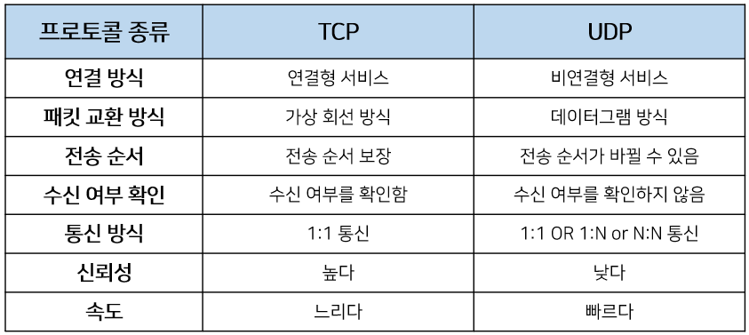

# TCP vs UDP

#### 전송계층에서 사용되는 프로토콜

## TCP ( Transmission Control Protocol )

#### 신뢰성을 보장하는 연결형 서비스

- 인터넷상에서 데이터를 메세지의 형태로 보내기 위해 IP와 함께 사용하는 프로토콜
- 일반적으로 TCP와 IP를 함께 사용하는데, IP가 데이터의 배달을 처리한다면 TCP는 패킷을 추적 및 관리

### 특징

#### 1. 연결형 서비스

> 연결형 서비스로 가상 회선 방식을 제공한다.

- 3-way-handshaking 과정을 통해 연결을 설정
- 4-way-handshaking 을 통해 연결을 해제

#### 2. 흐름 제어 ( Flow control )

> 데이터 처리 속도를 조절하여 수신자의 버퍼 오버플로우를 방지

- 송신하는 곳에서 감당이 안되게 많은 데이터를 빠르게 보내 수신하는 곳에서 문제가 일어나는 것을 막는다.
- 수신자가 `윈도우 크기 ( Window Size )` 값을 통해 수신량을 정할 수 있다.

#### 3. 혼잡 제어 ( Congestion control )

> 네트워크 내의 패킷 수가 넘치게 증가하지 않도록 방지

- 정보의 소통량이 과다하면 패킷을 조금만 전송하여 혼잡 붕괴 현상이 일어나는 것을 막는다.

#### 4. 신뢰성이 높은 전송 ( Reliable transmission )

- Dupack-based retransmission
  - 정상적인 상황에서는 ACK 값이 연속적으로 전송되어야 한다.
  - 그러나 ACK 값이 중복으로 올 경우 패킷 이상을 감지하고 재전송을 요청한다.
- Timeout-based retransmission
  - 일정시간동안 ACK 값이 수신을 못할 경우 재전송을 요청한다.

#### 5. 전이중, 점대점 방식

- 전이중 ( Full-Duplex )
  - 전송이 양방향으로 동시에 일어날 수 있다.
- 점대점 ( Point to Point )
  - 각 연결이 정확히 2개의 종단점을 가지고 있다.

## UDP ( User Datagram Protocol )

#### 신뢰성을 보장하지 않는 비연결형 서비스

- 데이터를 데이터그램 단위로 처리하는 프로토콜
- 정보를 보낸다는 신호나 받는다는 신호 절차를 거치지 않음

### 특징

#### 1. 비연결형 서비스

> 비연결형 서비스로 데이터그램 방식을 제공한다.

#### 2. 낮은 신뢰성

> 정보를 주고 받을 떄 정보를 보내거나 받는다는 신호절차를 거치지 않음

#### 3. TCP 보다 빠른 속도

- 실시간 서비스(streming) 등 신뢰성보다는 연속성이 중요한 서비스에 사용된다.

## 비교

