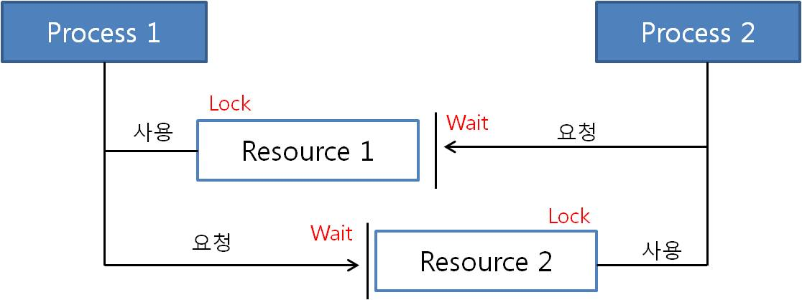
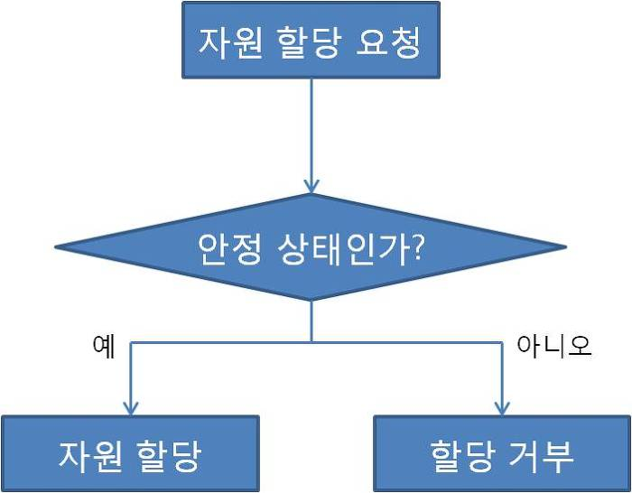
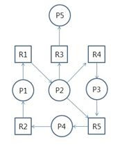

# 교착 상태 (데드락, DeadLock)

> 둘 이상의 프로세스가 다른 프로세스가 점유하고 있는 자원을 서로 기다릴 때 무한 대기에 빠지는 상황

## 발생 조건

- 교착 상태는 한 시스템 내에서 다음의 네 가지 조건이 동시에 성립할 떄 발생한다.
- 따라서 아래의 네 가지 조건 중 하나라도 성립하지 않도록 만든다면 해결할 수 있다.

### 1. 상호 배제 (Mutual exclusion)

- 자원은 한 번에 한 프로세스만이 사용할 수 있어야 한다.

### 2. 점유 대기 (Hold and wait)

- 최소한 하나의 자원을 점유하고 있으면서 다른 프로세스에 할당되어 사용하고 있는 자원을 추가로 점유하기 위해 대기하는 프로세스가 있어야 한다.

### 3. 비선점 (No preemption)

- 다른 프로세스에 할당된 자원은 사용이 끝날 때까지 강제로 빼앗을 수 없어야 한다.

### 4. 순환 대기 (Circular wait)

- 프로세스의 집합 (P0,P1,...Pn)에서 P0는 P1이 점유한 자원을 대기하고 P1은 P2가 점유한 자원을 대기하고 P2...Pn-1은 Pn이 점유한 자원을 대기하여 Pn은 P0가 점유한 자원을 요구해야 한다.

## 해결

### 예방

> 데드락의 발생 조건 4가지 중 하나라도 발생하지 않게 하는 것

- 자원의 상호 배제 조건 방지

  - 한 번에 여러 프로세스가 공유 자원을 사용할 수 있게 한다.
  - 그러나 추후 동기화 관련 문제가 발생할 수 있다.

- 점유 대기 조건 방지

  - 프로세스 실행에 필요한 모든 자원을 한꺼번에 요구하고 허용할 때까지 작업을 보류해서, 나중에 또 다른 자원을 점유하기 위한 대기 조건을 성립하지 않도록 한다.

- 비선점 조건 방지

  - 이미 다른 프로세스에게 할당된 자원이 선점권이 없다고 가정할 때, 높은 우선순위의 프로세스가 해당 자원을 선점할 수 있도록 한다.

- 순환 대기 조건 방지
  - 자원을 순환 형태로 대기하지 않도록 일정한 한 쪽 방향으로만 자원을 요구할 수 있도록 한다.

> 시스템 처리량이나 효율성을 떨어뜨리는 단점 발생

### 예방

> 교착 상태가 발생하면 피해나가는 방법

#### 은행원 알고리즘

- 프로세스가 자원을 요구할 때 시스템은 자원을 할당한 후에도 안정 상태로 남아있게 되는지를 사전에 검사하여 교착 상태를 회피하는 기법
- 안정 상태에 있으면 자원을 할당하고, 그렇지 않으면 다른 프로세스들이 자원을 해지할 때까지 대기함

### 탐지

- 자원 할당 그래프를 통해 교착 상태 감지
  

- 프로세스 Pi로부터 자원 Rj로의 방향 간선은 Pi -> Pj로 표현하며 이것은 **프로세스 Pi가 자원 Rj를 요청하는 것으로 현재 이 자원을 기다리는 상태**이다.

- 자원 Rj로부터 프로세스 Pi로의 방향 간선은 Rj -> Pi로 표현하며 이것은 **자원이 프로세스 Pi에 이미 할당된 것**을 의미한다.
- 자원을 요청할 때마다 탐지 알고리즘을 실행하면 그에 대한 오버헤드가 생긴다.

### 회복

> 교착 상태를 일으킨 프로세스를 종료하거나, 할당된 자원을 해제함으로써 회복하는 것을 의미한다.

#### 프로세스를 종료하는 방법

- 교착 상태의 프로세스를 모두 중지
- 교착 상태가 제거될 때까지 한 프로세스씩 중지

#### 자원을 선점하는 방법

- 교착 상태의 프로세스가 점유하고 있는 자원을 선점하여 다른 프로세스에게 할당하며, 해당 프로세스를 일시 정지시키는 방법
- 우선 순위가 낮은 프로세스, 수행된 횟수가 적은 프로세스 등을 위주로 프로세스의 자원을 선점한다.
