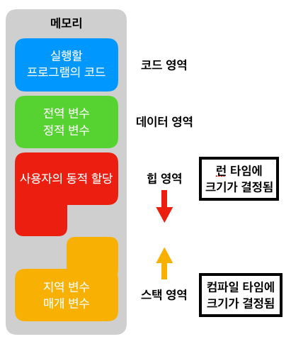

# 메모리 구조

> 프로그램이 실행되면 OS는 메모리에 공간을 할당해준다. 이때 할당해주는 공간은 4가지(Code,Data,Stack,Heap)으로 구성되어있다.

## 코드 (Code) 영역

> 우리가 작성한 소스코드가 들어가는 부분, 즉 실행할 프로그램의 코드가 저장.

- 텍스트 영역이라고도 부른다.
- 실행 파일을 구성하는 명령어들이 올라가는 메모리 영역으로 함수, 제어문, 상수 등이 여기에 지정된다.

## 데이터 (Data) 영역

> 전역변수와 static 변수가 할당되는 영역

- 프로그램의 시작과 동시에 할당되고, 프로그램이 종료되어야 메모리가 소멸되는 영역

## 스택 (Stack) 영역

> 프로그램이 자동으로 사용하는 임시 메모리 영역

- 함수 호출시 생성되는 지역 변수와 매개변수가 저장되는 영역
- 함수 호출이 완료되면 사라진다.
- 메모리의 높은 주소에서 낮은 주소의 방향으로 할당된다.
- 컴파일 시에 크기가 결정된다.

## 힙 (Heap) 영역

> 프로그래머가 할당/해제하는 메모리 공간

- 이 공간에 메모리를 할당하는 것을 동적 할당이라고도 부른다.
- 메모리의 낮은 주소에서 높은 주소의 방향으로 할당된다.
- 런타임 시에 크기가 결정된다.

# Stack vs Heap

- Stack 영역이 클 수록 Heap 영역이 작아지고 Heap 영역이 클 수록 Stack 영역이 작아진다.

**Heap overflow**

- Heap이 위에서부터 주소값을 채워져 내려오다가 Stack영역을 침범하는 경우

**Stack overflow**

- Stack영역이 Heap을 침범하는 경우.
