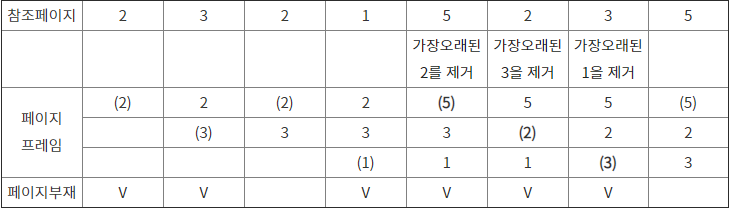
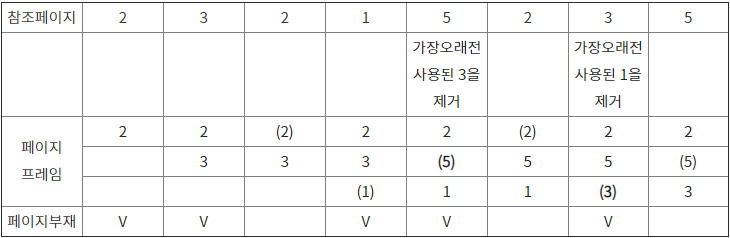

# 페이지 교체 알고리즘

> 페이지 부재가 발생했을 때 가상기억장치의 필요 페이지를 주기억장치에 적재해야하는데 어떤 페이지 프레임을 선택해 교체할 것인지를 결정하는 기법

```
페이지(Page) : 가상 메모리를 일정된 한 크기로 나눈 블록
페이지 부재: CPU가 엑세스한 페이지가 주기억장치에 없는 경우로, 페이지 부재 발생 시 해당 페이지를 주기억장치로 가져와야 함
```

## FIFO ( First In First Out )

- 가장 먼저 들어와서 가장 오래 있었던 페이지를 교체하는 기법
- 각 페이지가 주기억장치에 들어올 때마다 타임스탬프를 찍어 기억하는 방식



## LRU ( Least Recently Used )

- 최근에 가장 오랫동안 사용하지 않은 페이지를 교체하는 기법
- 각 페이지마다 카운터나 스택을 두어 현 시점에서 가장 오랫동안 사용하지 않은 ( 가장 오래전에 사용된 ) 페이지를 교체함



## LFU ( Last Frequently Used )

- 사용 빈도가 가장 적은 페이지를 교체하는 기법
- 즉, 호출된 횟수가 가장 적은 페이지를 교체
- 바로 불러온 페이지가 교체될 수 있다는 단점이 존재함
